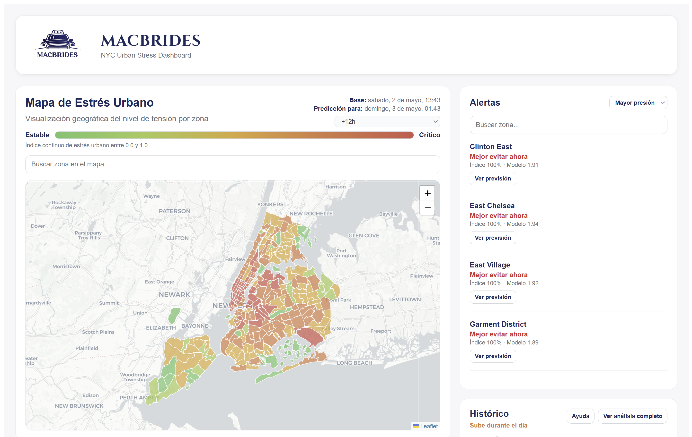

# MacBrides

<p align="center">
  
</p>

## Descripción

Proyecto de **Proyecto de Datos II (UCM, 2025/26)**.  
El objetivo es **analizar el sistema de transporte de pago en Nueva York** (taxis/VTC) e incorporar fuentes externas (meteorología y eventos) para:

- Entender patrones de demanda (zonas/horas)
- Detectar tensiones del sistema (picos, desigualdad, variabilidad…)
- Proponer una **aplicación basada en datos** con impacto medible
- Respaldar la propuesta con visualizaciones y estudio de mercado 

---

### Componentes principales

- **Backend analítico**: Pipeline de datos escalable con PySpark para procesar decenas de millones de viajes
- **Modelos de machine learning**: Predicción de demanda máxima por zona, estimación de propinas y análisis de estrés urbano
- **Aplicación web**: Dashboard interactivo para visualización de patrones y toma de decisiones
- **Arquitectura por capas**: Procesamiento estructurado desde datos crudos hasta insights finales

### Impacto esperado

- **Para operadores de transporte**: Optimización de flotas y precios dinámicos
- **Para ciudad**: Mejor comprensión de la movilidad urbana y planificación de infraestructuras
- **Para usuarios**: Mejora en la experiencia de viaje mediante predicciones precisas

---

### Funcionalidades

- **Extracción** de fuentes reales:
  - TLC (viajes taxi / VTC)
  - **Meteorología** (Open-Meteo)
  - **Eventos** (NYC Open Data)
- **Pipeline por capas**:
  - `Capa 0` (exploración y muestreo inicial de los datos raw de TLC para estimar volumen, precio medio, hora pico y estructura por servicio y mes, generando un resumen exportable)
  - `Capa 1` (control de calidad estructural sobre los datos en bruto (raw), usando como referencia los Data Dictionaries oficiales de TLC)
  - `Capa 2` (limpieza + estandarización)
  - `Capa 3` (agregación lista para análisis y cruces)
- **Visualizaciones** para justificar la propuesta (viajes vs meteo vs eventos)

---

## Estructura general del repositorio
```
Grupo-PD2---Transporte-NYC/
├── src/
│ ├── extraccion/          ← Extracción de datos desde APIs y fuentes externas
│ │ └── main.py                     ← Orquestador de extracción
│ ├── procesamiento/       ← Pipeline de limpieza y transformación
│ │ ├── capa1/             ← Validación estructural por servicio
│ │ ├── capa2/             ← Estandarización y normalización
│ │ └── capa3/             ← Agregaciones y datasets ML-ready
│ ├── ml/                  ← Modelos de machine learning
│ │ ├── models_ej1/        ← Modelos para ejercicios 1a-1d
│ │ └── models_ej2/        ← Modelos para ejercicio 2
│ └── visualizaciones/     ← Análisis exploratorio y gráficos
├── backend/               ← API REST con FastAPI
│ └── app/
├── frontend/              ← Aplicación web React + Vite
├── config/                ← Configuración centralizada
├── data/                  ← Datos organizados por capas
│ ├── raw/                 ← Datos originales descargados
│ ├── validated/           ← Datos validados (capa 1)
│ ├── standarized/         ← Datos estandarizados (capa 2)
│ ├── aggregated/          ← Agregados para análisis (capa 3)
│ └── external/            ← Datos externos (meteo, eventos)
├── docs/                  ← Documentación detallada
├── notebooks/             ← Jupyter notebooks para análisis
├── outputs/               ← Resultados de modelos y visualizaciones
├── pyproject.toml         ← Dependencias Python (uv)
├── package.json           ← Scripts de proyecto
├── uv.lock                ← Lockfile de dependencias
└── README.md              ← Este documento
```

---

- Archivo __`src/main.py`__: Script orquestador principal del proyecto. Ejecuta de forma secuencial el pipeline completo: extracción de datos (TLC, meteorología, eventos), procesamiento por capas (capa1 → capa2 → capa3) y entrenamiento de modelos de machine learning. Permite ejecutar todo el proyecto desde datos externos hasta modelos entrenados mediante un único comando.

---

## Flujo de datos (pipeline completo)

El proyecto implementa un pipeline de datos estructurado en capas que transforma datos crudos en insights accionables:

### Capa 1: Validación y limpieza
- **Objetivo**: Control de calidad estructural usando Data Dictionaries oficiales de TLC
- **Procesamiento**: 
  - Validación de tipos de datos y dominios permitidos
  - Detección de errores temporales (fechas futuras, duración negativa)
  - Cálculo de velocidad implícita y filtros de plausibilidad
- **Salida**: Datos validados separados en `clean` y `bad_rows`, con reports JSON

### Capa 2: Estandarización
- **Objetivo**: Unificación de esquemas entre servicios (yellow, green, fhvhv)
- **Procesamiento**:
  - Normalización de timestamps y columnas de precio
  - Cálculo de variables derivadas (duración, día de semana, etc.)
  - Enriquecimiento con zonas TLC (borough y zone)
- **Salida**: Datos estandarizados en Parquet particionado por año/mes/servicio

### Capa 3: Agregación y datasets ML-ready
- **Objetivo**: Generación de agregados para análisis y construcción de datasets para modelos
- **Procesamiento**:
  - Agregados base: demanda diaria, hotspots zona-hora, variabilidad de precios
  - Enriquecimiento con datos externos (meteorología, eventos, alquileres, restaurantes)
  - Construcción de features para ML (lags, rolling means, variables externas)
- **Salida**: Datasets particionados listos para modelado y visualización

### Modelos de Machine Learning
- **Ejercicio 1a**: Clasificación multiclase para predecir zona de máxima demanda en la siguiente hora
- **Ejercicio 1b**: Regresión para predecir monto de propina usando solo información a priori
- **Ejercicio 1c-1d**: Análisis de patrones de demanda y poder adquisitivo
- **Ejercicio 2**: Modelos para dashboard de estrés urbano

### Visualizaciones y aplicación web
- **Backend**: API REST con FastAPI para servir datos y predicciones
- **Frontend**: Dashboard React con mapas interactivos y gráficos de tendencias
- **Visualizaciones**: Heatmaps, series temporales, análisis comparativos

---

## Tecnologías utilizadas

### Lenguajes y frameworks principales
- **Python 3.11+**: Lenguaje principal para todo el pipeline de datos y ML
- **PySpark 4.1+**: Procesamiento distribuido de big data (decenas de millones de filas)
- **FastAPI**: Framework para API REST del backend
- **React 19**: Framework JavaScript para el frontend
- **Vite**: Build tool para desarrollo rápido del frontend

### Librerías de datos y ML
- **Pandas/PyArrow**: Manipulación de datos tabulares y lectura de Parquet
- **DuckDB**: Consultas SQL analíticas sobre datos locales
- **Scikit-learn**: Modelos de ML tradicionales (regresión, clasificación)
- **XGBoost**: Gradient boosting para problemas de clasificación/regresión
- **PyTorch**: Deep learning (redes neuronales para ejercicio 2)
- **GeoPandas**: Análisis geoespacial y mapas

### Visualización y UI
- **Matplotlib/Seaborn**: Gráficos estáticos para análisis exploratorio
- **Folium/Leaflet**: Mapas interactivos en el dashboard
- **Recharts**: Gráficos interactivos en React
- **Jupyter**: Notebooks para experimentación y documentación

### Infraestructura y herramientas
- **uv**: Gestor moderno de dependencias Python (reemplaza pip/venv)
- **MinIO**: Object storage para datos (S3-compatible)
- **Git**: Control de versiones
- **Rich**: CLI con barras de progreso y formato coloreado

### Fuentes de datos
- **TLC Trip Records**: Viajes de taxis/VTC en formato Parquet desde AWS S3
- **Open-Meteo API**: Datos meteorológicos horarios
- **NYC Open Data**: Eventos urbanos y datos socioeconómicos
- **Zonificación TLC**: Catálogo oficial de zonas de taxi en NYC

### Entorno de desarrollo
- **Java 17**: Requerido para PySpark
- **VS Code**: IDE recomendado con extensiones Python y Jupyter
- **Linux/macOS/Windows**: Soportado (con configuraciones específicas para Spark)

---

## Instalación del entorno

Pasos necesarios para instalar el proyecto. Descripción paso a paso de cómo poner en funcionamiento el entorno de desarrollo.

----

**1.** Clonar el repositorio:  

```
git clone https://github.com/maritriv/Grupo-PD2---Transporte-NYC.git
cd Grupo-PD2---Transporte-NYC
```

----

**2.** Descarga las librerías necesarias creando automáticamente un entorno virtual con `uv sync` (desde la ubicación del `pyproject.toml`):
Instala uv (si no lo tienes instalado):
```
   pip install uv
```

```
uv sync
```

**⚠️ Configuración necesaria para Spark**
Este proyecto utiliza **PySpark** para las visualizaciones y agregaciones. Es necesario tener Java 17 (JDK) correctamente configurado.

**2.1. Instalar Java 17**

Si no tienes Java 17 instalado, accede a este enlace y descarga Temurin 17 (JDK).

[Enlace a Temurin 17](https://adoptium.net/es)

Verifica la instalación:
```
java -version
```

Debe mostrar algo similar a:
```
openjdk version "17.x.x"
```
**2.2. Configurar las variables de entorno**

🪟 En Windows (PowerShell):
```
$env:JAVA_HOME="C:\Program Files\Eclipse Adoptium\jdk-17.x.x"
$env:Path="$env:JAVA_HOME\bin;$env:Path"
$env:PYSPARK_PYTHON="python"
$env:PYSPARK_DRIVER_PYTHON="python"
```

🐧 En macOS / Linux:
Añadir al .zshrc o .bashrc:
```
export JAVA_HOME=$(/usr/libexec/java_home -v 17)
export PATH=$JAVA_HOME/bin:$PATH
export PYSPARK_PYTHON=python3
export PYSPARK_DRIVER_PYSPARK_PYTHON=python3
```
Aplicar cambios:
```
source ~/.zshrc
```

**2.3**. Configurar Hadoop (obligatorio en Windows)

Spark en Windows necesita `winutils.exe` y `hadoop.dll`.

Crea la estructura: `C:\hadoop\bin\`

Para descargar los archivos necesarios puedes obtenerlos desde repositorios compatibles con tu versión de Hadoop/Spark (por ejemplo Hadoop 3.x).

[Repositorio recomendado](https://github.com/cdarlint/winutils)

Este repositorio incluye tanto el archivo `winutils.exe`como el archivo `hadoop.dll`

Una vez descargados, copia ambos archivos dentro de: `C:\hadoop\bin\`

**2.4** Configurar variables de Hadoop

Ejecuta:
```bash
$env:HADOOP_HOME="C:\hadoop"
$env:PATH="C:\hadoop\bin;$env:PATH"
```

Verifica la instalación con:
```bash
Get-Command winutils.exe
Get-Command hadoop.dll
```

Debe devolver:
```bash
C:\hadoop\bin\winutils.exe
C:\hadoop\bin\hadoop.dll
```

----
**3. Descargar los datos**

Los datos del proyecto se almacenan en **MinIO** (object storage).

Para descargarlos y mantener la estructura de directorios original, ejecuta:

```bash
uv run -m src.extraccion.download_from_minio
```

Por defecto:

- Descarga todo el contenido bajo data/

- Mantiene la misma estructura de carpetas

- Omite archivos que ya existen localmente

Opciones útiles:

```bash
# Descargar solo una subcarpeta
uv run -m src.extraccion.download_from_minio --prefix data/raw/

# Descargar en un directorio específico
uv run -m src.extraccion.download_from_minio --dest-dir /ruta/destino

# Forzar descarga (sobrescribir existentes)
uv run -m src.extraccion.download_from_minio --no-skip
```

> Es necesario que el archivo `credentials.json` esté configurado en la raíz del proyecto antes de ejecutar la descarga.

## Ejecución de la página web
Este proyecto puede ejecutarse de varias formas, dependiendo de si quieres levantar `backend` y `frontend` por separado o todo a la vez.

### Opción 1: Ejecución manual
**1. Levantar el backend**

Abre una terminal en la raíz del proyecto y ejecuta:
```bash
uv run -m uvicorn backend.app.main:app --reload
```

Si todo va bien, verás algo como:
```bash
Uvicorn running on http://127.0.0.1:8000
```

Puedes comprobar que funciona abriendo:
```bash 
http://127.0.0.1:8000/api/health
```

Debería devolver: `{"status":"ok"}`


**2. Levantar el frontend**

En otra terminal:
```bash
cd frontend
npm install
npm run dev
```

Vite te mostrará una URL, normalmente:
```bash
http://localhost:5173
```
Abre esa dirección en el navegador.

### Opción 2: Instalación completa del proyecto

Si es la primera vez que clonas el proyecto, puedes instalar todo de una vez:
```bash
npm run setup
```
Esto ejecuta:

- Instalación del backend (dependencias Python)
- Instalación del frontend (npm)

Puedes levantar backend + frontend automáticamente con un solo comando:
```bash
npm run dev
```
Esto usa `concurrently` y ejecuta:

- Backend: `uvicorn`
- Frontend: `vite`

Verás ambos logs en la misma terminal.

### Scripts disponibles
Desde la raíz del proyecto:
```bash
npm run setup        # Instala todo el proyecto
npm run dev          # Ejecuta backend + frontend juntos
npm run dev:backend  # Solo backend
npm run dev:frontend # Solo frontend
```
--- 

## Equipo de desarrollo

Este proyecto fue desarrollado por los siguientes estudiantes del Grado en Ingeniería de Datos e Inteligencia Artificial (UCM): 
- Vega García Camacho
- Rosa Gómez-Gil Jónsdóttir 
- Daniel Higueras Llorente
- Ignacio Ramírez Suárez
- Marina Triviño de las Heras

##  Recursos adicionales
# Memorias y presentaciones
**Entrega 1**
- [Presentación Entrega 1](https://docs.google.com/presentation/d/1tKNixIGUhMHiNGJyOn6zXNW0MvKN4t1Iz4JFZ0_KaAE/edit?slide=id.g3c872e10c63_0_294#slide=id.g3c872e10c63_0_294)
- [Memoria Entrega 1](https://docs.google.com/document/d/1znwca7mk1cS6DRcjjuXsSMnBJvdzIXBFVLbBbsAFyls/edit?usp=sharing)
- [Entrega 1: Distribución del Trabajo](https://docs.google.com/document/d/1K5g5cqhqr7BZ0P4KehW0uqv_OZGyN_cjHm6tFBikYTY/edit?usp=sharing)

**Entrega 2**
- [Presentación Entrega 2]()
- [Video]()
- [Memoria Entrega 2](https://docs.google.com/document/d/1BeDUwpIIZ76oQSTDzrjcvYsROVYALI4uF1sLKIetDtw/edit?usp=sharing)
- [Entrega 2: Distribución del Trabajo](https://docs.google.com/document/d/19Q7bwqnLdEIqhRjMFr6UOWoBgs1nh_71DfUrqB43VlE/edit?usp=sharing)

# Visualizaciones
- [Google drive](https://drive.google.com/drive/folders/1gWM-5GU0OTZgczfwt1Mxz7wQFQUuLo5Z?usp=drive_link)
