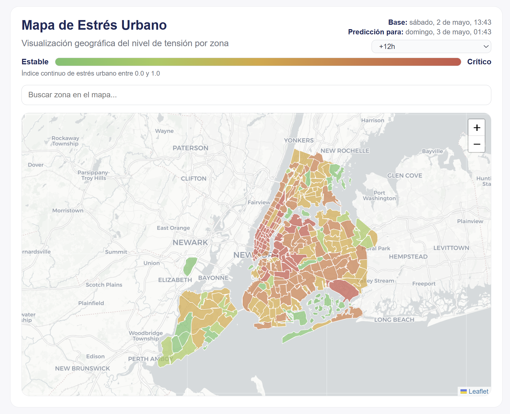
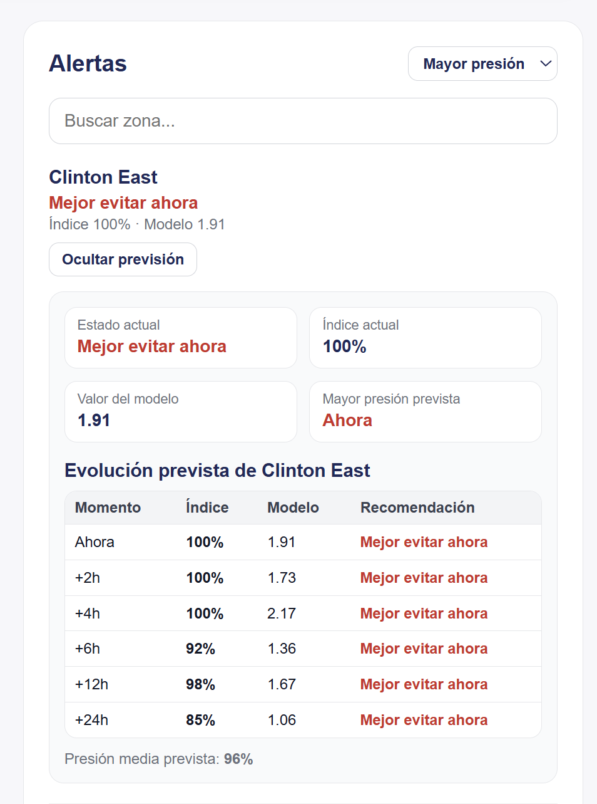
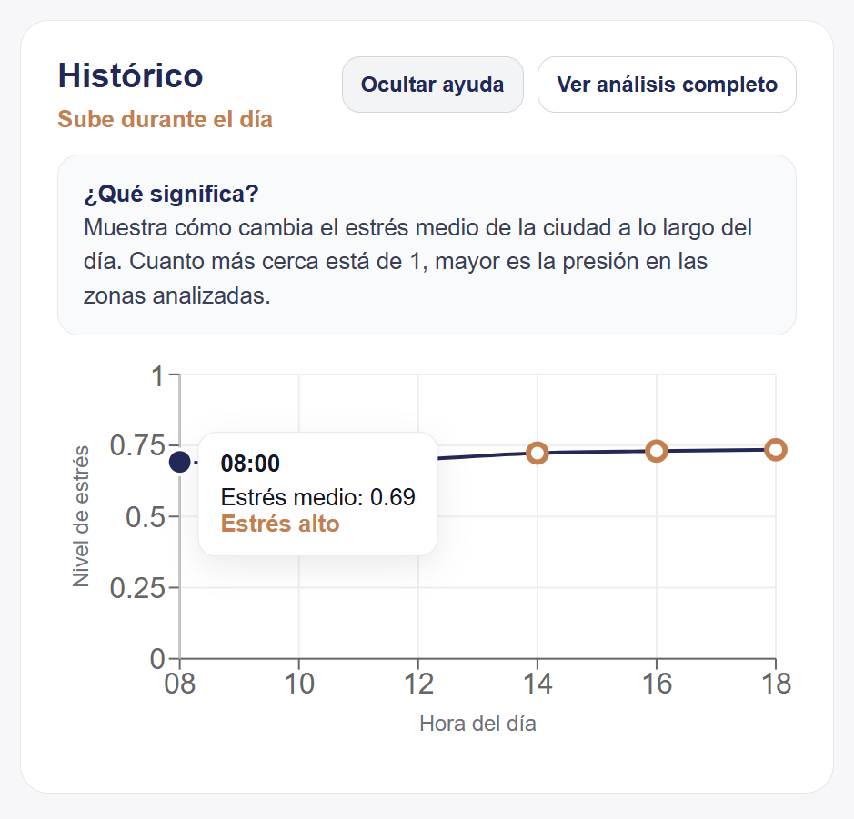
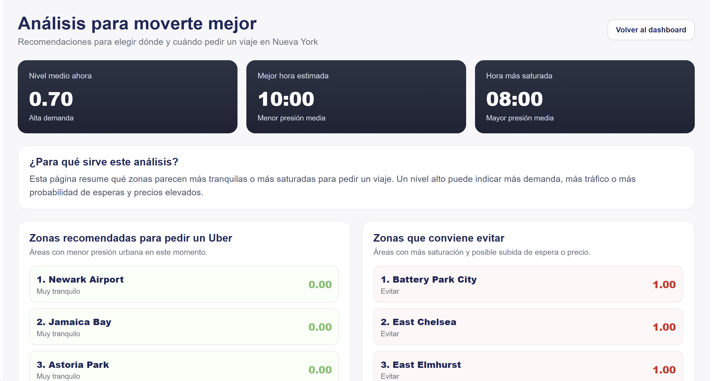

# MacBrides Web

Aplicación web desarrollada con **React + Vite** para visualizar el nivel de presión urbana en zonas de Nueva York y ayudar al usuario a decidir **dónde y cuándo pedir un viaje**.

La web consume las predicciones del backend FastAPI y las presenta de forma visual mediante mapa, tarjetas resumen, alertas, histórico y análisis completo.

---

## Objetivo de la web

El objetivo principal es transformar las predicciones del modelo en una herramienta sencilla para usuarios finales.

La aplicación permite:

- Consultar el nivel de presión por zona.
- Detectar zonas recomendadas y zonas a evitar.
- Ver la evolución estimada durante el día.
- Consultar previsiones por zona.
- Acceder a un análisis más completo para decidir mejor cuándo moverse.

---

## Pantallas principales

### Dashboard principal

El dashboard muestra el estado general de la ciudad para un día y hora seleccionados.

Incluye:

- Mapa interactivo por zonas.
- KPIs principales.
- Histórico de presión urbana.
- Panel de alertas con búsqueda y previsión por zona.

<p align="center">
  
</p>

---

### Mapa de presión urbana

El mapa colorea cada zona según el índice estimado de presión.

Los colores representan:

- Verde: zona más recomendable.
- Amarillo/naranja: presión intermedia.
- Rojo: zona con alta presión o recomendable evitar.

<p align="center">
  
</p>

---

### Alertas y previsión

El panel de alertas permite identificar rápidamente las zonas con mayor o menor presión.

Cada zona muestra:

- Recomendación textual.
- Índice normalizado.
- Valor interno del modelo.
- Previsión para próximas horas.

<p align="center">
  
</p>

---

### Histórico

El histórico muestra cómo cambia la presión media durante distintas horas del día.

Sirve para entender si la situación tiende a mejorar, empeorar o mantenerse estable.

<p align="center">
  
</p>


---

### Análisis completo

La página de análisis resume la información más útil para el usuario:

- Presión media actual.
- Mejor hora estimada para moverse.
- Hora más saturada.
- Zonas recomendadas para pedir un viaje.
- Zonas que conviene evitar.
- Comparación de presión media por horas.

<p align="center">
  
</p>

---

## Conceptos utilizados en la interfaz

### Índice

El índice es una escala visual de 0% a 100%.

- 0% indica menor presión relativa.
- 100% indica mayor presión relativa.

Este valor se usa para que el usuario pueda interpretar rápidamente la situación de cada zona.

### Modelo

El valor del modelo es la predicción original antes de convertirla a índice visual.

Se muestra como referencia adicional, pero la recomendación principal para el usuario se basa en el índice y la etiqueta textual.

### Presión urbana

En la web se usa el término presión urbana para representar una combinación de factores asociados a:

- demanda de viajes
- saturación de la zona
- posible aumento de espera
- posible incremento de precio
- tensión del sistema de transporte

---

## Componentes principales

```text
src/
├── api/
│   └── client.js              # Cliente para comunicarse con el backend
├── components/
│   ├── AlertsPanel.jsx        # Panel de alertas y previsión por zona
│   ├── Controls.jsx           # Selectores de día y hora
│   ├── HistoryChart.jsx       # Histórico de presión urbana
│   ├── KPICards.jsx           # Tarjetas resumen
│   └── MapView.jsx            # Mapa interactivo
├── pages/
│   ├── Home.jsx               # Dashboard principal
│   └── AnalyticsPage.jsx      # Página de análisis completo
├── App.jsx
└── main.jsx
```

--- 

## Tecnologías utilizadas
- React
- Vite
- Leaflet
- Recharts
- FastAPI como backend
- GeoJSON para las zonas TLC de Nueva York

---

## Ejecución del frontend

Desde la carpeta `frontend`:

```bash
## Ejecución de la página web
Este proyecto puede ejecutarse de varias formas, dependiendo de si quieres levantar `backend` y `frontend` por separado o todo a la vez.

### Opción 1: Ejecución manual
**1. Levantar el backend**

Abre una terminal en la raíz del proyecto y ejecuta:
```bash
uv run -m uvicorn backend.app.main:app --reload
```

Si todo va bien, verás algo como:
```bash
Uvicorn running on http://127.0.0.1:8000
```

Puedes comprobar que funciona abriendo:
```bash 
http://127.0.0.1:8000/api/health
```

Debería devolver: `{"status":"ok"}`


**2. Levantar el frontend**

En otra terminal:
```bash
cd frontend
npm install
npm run dev
```

Vite te mostrará una URL, normalmente:
```bash
http://localhost:5173
```
Abre esa dirección en el navegador.

### Opción 2: Instalación completa del proyecto

Si es la primera vez que clonas el proyecto, puedes instalar todo de una vez:
```bash
npm run setup
```
Esto ejecuta:

- Instalación del backend (dependencias Python)
- Instalación del frontend (npm)

Puedes levantar backend + frontend automáticamente con un solo comando:
```bash
npm run dev
```
Esto usa `concurrently` y ejecuta:

- Backend: `uvicorn`
- Frontend: `vite`

Verás ambos logs en la misma terminal.

### Scripts disponibles
Desde la raíz del proyecto:
```bash
npm run setup        # Instala todo el proyecto
npm run dev          # Ejecuta backend + frontend juntos
npm run dev:backend  # Solo backend
npm run dev:frontend # Solo frontend
```
--- 

## Endpoints consumidos

La web consume principalmente:

```bash
GET /api/map
GET /api/predict
GET /api/forecast
```

Estos endpoints devuelven las predicciones necesarias para pintar el mapa, las alertas, el histórico y el análisis completo.
